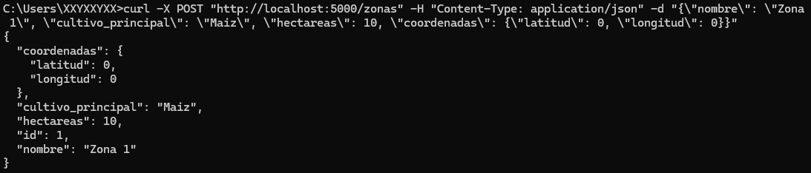
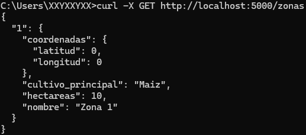
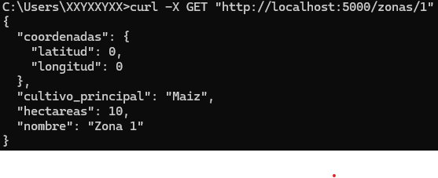
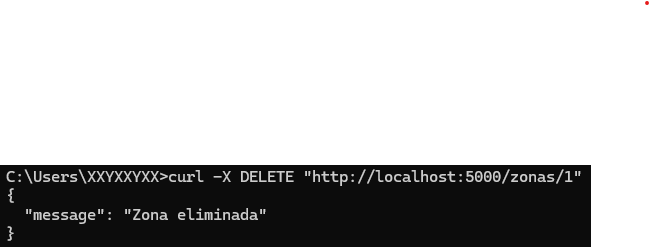
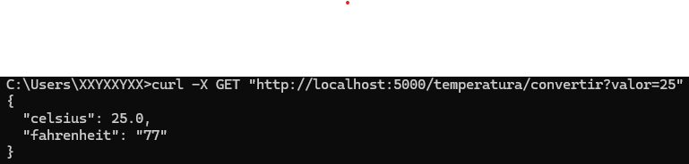

# 🌦️ ClimaSeguro - API REST + Cliente SOAP

Este proyecto es una API REST desarrollada con Flask que permite registrar zonas agrícolas y consultar temperaturas convertidas mediante un servicio SOAP externo. Es ideal para prácticas de integración de servicios REST y SOAP en un contexto agrícola.

## 📁 Estructura del proyecto

```text
clima_seguro_api/
├── api/
│   ├── __init__.py
│   ├── routes.py
│   └── temperature.py
├── app.py
├── config.py
├── requirements.txt
└── README.md
```


## 🚀 Instrucciones de ejecución

1. **Clonar el repositorio**  
   ```bash
   git clone https://github.com/tu_usuario/climaseguro.git
   cd climaseguro

2. **Instalar dependencias**
   ```bash
   pip install -r requirements.txt

3. **Ejecutar el servidor**
   ```bash
   python main.py

## 🌐 Acceder a la documentación Swagger

[http://localhost:5000/apidocs](http://localhost:5000/apidocs)

# 🔁 Pruebas con CURL

1. ✅ Registrar zona
   ```bash
   curl -X POST http://localhost:5000/zonas \
     -H "Content-Type: application/json" \
     -d "{\"nombre\":\"Zona Andina\",\"cultivo_principal\":\"Papa\",\"hectareas\":120,\"coordenadas\":{\"latitud\":-2.15,\"longitud\":-78.5}}"
   ```
   
   
2. 📋 Listar todas las zonas
   ```bash
   curl http://localhost:5000/zonas
   ```
   

3. 🔍 Obtener zona por ID
   ```bash
   curl http://localhost:5000/zonas/1
   ```
   

4. ❌ Eliminar zona
   ```bash
   curl -X DELETE http://localhost:5000/zonas/1
   ```
   

5. 🌡️ Convertir temperatura (SOAP)
   ```bash
   curl "http://localhost:5000/temperatura/convertir?valor=35"
   ```
   
